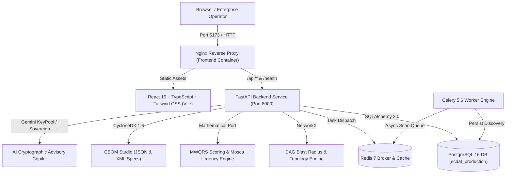

# ECDAT — Enterprise Cryptographic Discovery & Analysis Tool
## Production Deployment Runbook & Operational Architecture Guide

---

## 1. System Architecture Overview

ECDAT (Enterprise Cryptographic Discovery & Analysis Tool) is an enterprise-grade post-quantum cryptographic posture, discovery, and simulation platform designed to transition organizations from classical cryptography (RSA, ECC, Diffie-Hellman) to **NIST FIPS 203 (ML-KEM)**, **FIPS 204 (ML-DSA)**, and **FIPS 205 (SLH-DSA)**.



### Component Breakdown
| Layer | Technology | Responsibilities |
|---|---|---|
| **Frontend** | React 19, TypeScript, Vite, Tailwind CSS v3 | Executive Dashboard, Inventory Table, Remediation Queue, Mosca Timeline, NetworkX Graph, PQC Simulator, Scanner Suite, History Diff, AI Advisor |
| **Backend API** | FastAPI, Python 3.12, Uvicorn | 24+ REST endpoints, SSE telemetry streams, asynchronous scan dispatch, mathematical scoring models |
| **Data Layer** | PostgreSQL 16 (production) / SQLite (local dev) | Declarative SQLAlchemy 2.0 models for services, dependencies, assets, and scan snapshots |
| **Task Queue** | Celery 5.6, Redis 7 | Asynchronous network discovery scans, multi-target port probing, and background inventory ingestion |
| **Web Server** | Nginx Alpine Multi-stage | High-performance static SPA delivery and reverse proxy to the backend API |

---

## 2. Ground Truth Principles & Design System

### Visual & Design Standards
- **Aesthetic**: Constructivist museum-grade warm ivory and obsidian.
- **Background**: `#faf9f5` (warm ivory)
- **Cards & Surfaces**: `#f3ede2` / `#ffffff`
- **Text & Outlines**: `#111111` (deep obsidian)
- **Primary Accent**: `#ff3300` (kinetic vermilion)
- **Border Radius**: Strict `0px` (`border-radius: 0px !important`). Zero rounded corners.
- **Typography**: `Syne` (display titles) & `Geist` / `Geist Mono` (body text and metrics).

### Mathematical & Cryptographic Fidelity
- **MWQRS**: Mosca-Weighted Quantum Risk Score (0.0 to 100.0) evaluating Base Vulnerability (40%), Key Deficit (20%), Protocol Deprecation (20%), and Expiry Urgency (20%) scaled by Service Criticality (P0=1.35x, P1=1.15x, P2=1.0x, P3=0.8x).
- **Mosca Urgency**: $X + Y > Z$ inequality evaluating Migration Effort ($X$), Shelf-life ($Y$), and Quantum Threat Horizon ($Z$).
- **NIST PQC Replacements**:
  - RSA / Key Exchange $\to$ **NIST FIPS 203: ML-KEM-768 (Kyber)**
  - RSA / ECDSA Signatures $\to$ **NIST FIPS 204: ML-DSA-65 (Dilithium)**
  - Stateless Hash Signatures $\to$ **NIST FIPS 205: SLH-DSA (SPHINCS+)**
- **CBOM Specification**: Native **CycloneDX 1.6** Cryptographic Bill of Materials in JSON and XML.

---

## 3. Containerized 1-Click Deployment (Docker Compose)

### Prerequisites
- Docker Engine 24.0+
- Docker Compose v2.20+
- 4GB RAM minimum (8GB recommended)

### Quick Start
1. Clone the repository and navigate into the root directory:
   ```bash
   cd d:/ReactProj
   ```
2. Copy environment configuration:
   ```bash
   cp .env.example .env
   ```
3. Build and launch all 5 containers in daemon mode:
   ```bash
   docker compose up --build -d
   ```
4. Verify container health status:
   ```bash
   docker compose ps
   ```
   *Expected output: All 5 containers (`ecdat-postgres`, `ecdat-redis`, `ecdat-backend`, `ecdat-worker`, `ecdat-frontend`) in running / healthy state.*

5. Access the applications:
   - **Frontend Web Application**: [http://localhost:5173/](http://localhost:5173/)
   - **Backend API & Swagger Docs**: [http://localhost:8000/docs](http://localhost:8000/docs)
   - **Healthcheck Probe**: [http://localhost:8000/health](http://localhost:8000/health)

---

## 4. Native Local Development Workflow

### Prerequisites
- Node.js 20+ (Node 24 supported) & npm 10+
- Python 3.12+
- Git

### Backend Setup
1. Navigate to the backend directory:
   ```bash
   cd backend
   ```
2. Create and activate a Python virtual environment:
   ```bash
   python -m venv venv
   # Windows:
   .\venv\Scripts\activate
   # Linux/macOS:
   source venv/bin/activate
   ```
3. Install dependencies:
   ```bash
   pip install -r requirements.txt
   ```
4. Launch the FastAPI server with live reload:
   ```bash
   python -m uvicorn app.main:app --host 127.0.0.1 --port 8000 --reload
   ```
   *The database initializes automatically to `backend/ecdat.db` (SQLite) with pre-seeded demo services and crypto assets.*

### Frontend Setup
1. Navigate to the frontend directory:
   ```bash
   cd frontend
   ```
2. Install npm packages:
   ```bash
   npm install
   ```
3. Launch Vite development server:
   ```bash
   npm run dev -- --host 127.0.0.1 --port 5173
   ```
4. Open [http://127.0.0.1:5173/](http://127.0.0.1:5173/) in your browser.

---

## 5. Verification & Testing Runbook

ECDAT enforces a strict 4-point verification gate:

### 1. Backend Automated Integration Test Suite
Executes 29 comprehensive test cases across all 5 architectural subsystems:
```bash
cd backend
python -m pytest tests/ -v
```
*Expected: 29 passed in <5.0s, 0 failures.*

### 2. Frontend Typecheck
Validates strict TypeScript types with `verbatimModuleSyntax` conformance:
```bash
cd frontend
npx tsc --noEmit
```
*Expected: Exits code 0 with 0 errors.*

### 3. Frontend Linter
Validates lint rules using Oxlint:
```bash
cd frontend
npm run lint
```
*Expected: 0 errors across all 20+ source files.*

### 4. Production Bundle Build
Validates Vite bundler tree-shaking, CSS token compilation, and Rollup minification:
```bash
cd frontend
npm run build
```
*Expected: Clean output in `frontend/dist/` with 0 compile errors.*

---

## 6. Operational Maintenance & API Reference

### Healthcheck Endpoint
```bash
curl -s http://127.0.0.1:8000/health
```
```json
{
  "status": "healthy",
  "service": "ecdat-backend",
  "version": "2.0.0",
  "timestamp": "2026-09-22T17:35:00.000000Z"
}
```

### Recalculate System MWQRS Scores
```bash
curl -X POST http://127.0.0.1:8000/api/score/recalculate
```

### Re-seed Default Enterprise Topology
```bash
curl -X POST http://127.0.0.1:8000/api/demo/seed
```

### Capture Production Audit Snapshot
```bash
curl -X POST http://127.0.0.1:8000/api/snapshots/save \
  -H "Content-Type: application/json" \
  -d '{"name": "Manual Pre-Migration Baseline"}'
```

### Export CycloneDX 1.6 CBOM
- **JSON**: `GET http://127.0.0.1:8000/api/cbom/export?format=json`
- **XML**: `GET http://127.0.0.1:8000/api/cbom/export?format=xml`

---

## 7. Troubleshooting Guide

| Issue | Root Cause | Resolution |
|---|---|---|
| `Port 8000 already in use` | Another uvicorn process is active | Identify PID with `netstat -ano \| findstr :8000` and terminate with `taskkill /PID <PID> /F` (Windows) or `kill -9 <PID>` (Linux). |
| `Postgres connection refused` | Postgres container initializing | Ensure Docker Compose healthchecks pass before backend connects (`condition: service_healthy`). |
| `TypeError: verbatimModuleSyntax` | Type imported as value in TSX | Use `import type { Foo } from '...'` syntax. |
| `Gemini quota exceeded (429)` | External rate limit | Built-in Sovereign Cryptographic Expert Engine automatically engages as fallback with zero user disruption. |

---

*ECDAT Enterprise Cryptographic Discovery & Analysis Tool • NIST FIPS 203/204/205 Suite*
