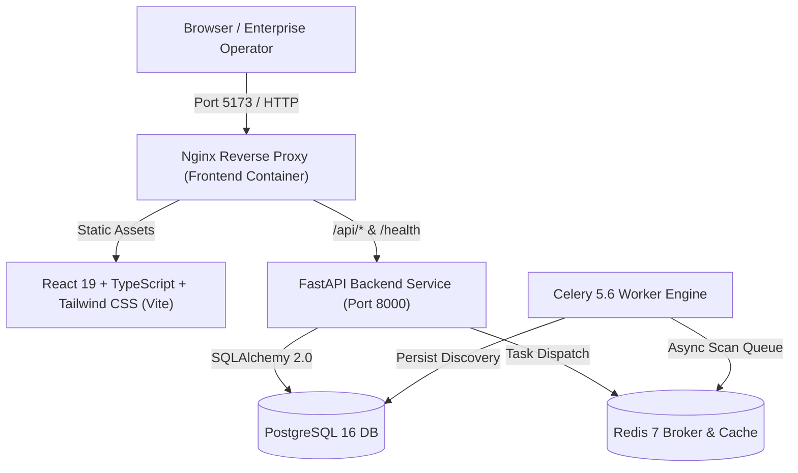

# ECDAT — Enterprise Cryptographic Discovery & Analysis Tool

> Post-quantum cryptographic posture, discovery, and simulation platform
> (SIH26164) deployed as a Vercel SPA + FastAPI backend.

---

## 1. Production Deployment Runbook

### Architecture overview



### Component breakdown

| Layer | Technology | Responsibilities |
|---|---|---|
| **Frontend** | React 19, TypeScript, Vite, Tailwind CSS (Vercel SPA) | Executive Dashboard, Inventory, Remediation Queue, Timeline, Dependency Graph, PQC Simulator, Scanner Suite, History Diff, AI Advisor, **Login** |
| **Backend API** | FastAPI, Python 3.12, Uvicorn | 24+ REST endpoints, SSE telemetry streams, async scan dispatch, scoring models |
| **Data Layer** | PostgreSQL 16 (production) / SQLite (local dev) | SQLAlchemy 2.0 models |
| **Task Queue** | Celery 5.6, Redis 7 | Async scans, multi-target probing |
| **Web Server** | Nginx Alpine / Vercel edge | Static SPA + SPA fallback |

### Frontend — Vercel SPA

The frontend is a **static SPA deployed to Vercel**. It uses a local `nginx.conf` only for the Docker Compose path; Vercel does the same routing via `vercel.json`.

#### Prerequisites

- Node.js 20+ & npm 10+
- (Local Docker) Docker Engine 24.0+, Docker Compose v2.20+

#### Setup (local dev)

```bash
cp .env.example .env
cp frontend/.env.example frontend/.env
cd frontend
npm install
npm run dev -- --host 0.0.0.0 --port 5173
```

Open http://127.0.0.1:5173/.

#### Vercel deployment

1. Push the repo to GitHub (or push directly to Vercel).
2. In **Vercel → Project Settings → Environment Variables**, add:
   - `VITE_SUPABASE_URL` (your Supabase project URL)
   - `VITE_SUPABASE_ANON_KEY` (the anon public key — **client-side only**)
3. Create a **Supabase project** in the dashboard:
   - `Project Settings → API` → copy `project_url` + `anon public key`.
   - Enable **Email + Google** providers under `Authentication → Providers`.
4. Click **Deploy**; `vercel.json` handles `SPA fallback` and `/api/` routing.

The `vercel.json` routes are:

- `^/api/(.*)$` → proxy to your backend (`/api/$1`)
- `^(.*)$` → `index.html` (so client-side routing never 404s)

#### Vercel environment variables (never commit)

| Variable | Where it lives | Required |
|---|---|---|
| `VITE_SUPABASE_URL` | Vercel project env (masked) | Yes |
| `VITE_SUPABASE_ANON_KEY` | Vercel project env (masked) | Yes |
| `NODE_ENV` | Vercel (auto-set) | No |

#### Local dev with Docker Compose

```bash
docker compose up --build -d
```

The `frontend` service reads the same `VITE_*` variables from its own `.env` file (see `frontend/.env.example`), so the local SPA and Vercel share the same configuration path.

### Backend

```bash
cd backend
cp .env.example .env   # uncomment / set DATABASE_URL, REDIS_URL, CORS_ORIGINS
python -m venv venv
source venv/bin/activate
pip install -r requirements.txt
uvicorn app.main:app --host 0.0.0.0 --port 8000
```

### Healthcheck & verification

```bash
curl -s http://127.0.0.1:8000/health
cd frontend && npx tsc --noEmit && npm run build
```

---

## 2. Authentication (Supabase)

This project uses **Supabase client-side auth only** (no `@supabase/ssr` SSR cookie dance). Sessions persist in `localStorage` and sync across refreshes via `supabase.auth.onAuthStateChange`.

- **Sign-in:** Google OAuth (`signInWithOAuth('google')`) and Email+Password (`signInWithPassword`).
- **Sign-up:** Email + password (`signUpWithEmail`), which sends a confirmation link.
- **Face icon:** The `FaceIcon` component is interactive and clickable; clicking it opens the login flow (the `onFaceClick` prop routes to `/login`).
- **Session read:** `getSession()`/`getAuthenticatedUser()` read the stored session; the `LoginPage` gates the UI between a signed-in state and a signed-out state.

### Supabase setup checklist

1. Create a project → copy `VITE_SUPABASE_URL` + `VITE_SUPABASE_ANON_KEY`.
2. `Authentication → Providers` → enable **Google** and **Email** (with confirmed email requirement if desired).
3. Set the redirect URL to `https://<your-domain>/` (or the OAuth callback path Supabase expects).
4. In Vercel project env, add `VITE_SUPABASE_URL` and `VITE_SUPABASE_ANON_KEY`.

> **Security rule:** the anon key is only used in the browser client. Never expose the Service Role key anywhere in the frontend.

---

## 3. Containerized 1-Click Deployment (Docker Compose)

### Prerequisites

- Docker Engine 24.0+, Docker Compose v2.20+, 4GB RAM (8GB recommended).

### Quick start

```bash
cp .env.example .env
docker compose up --build -d
docker compose ps
```

### Access

- Frontend: http://localhost:5173
- Backend API & Swagger: http://localhost:8000/docs
- Healthcheck: http://localhost:8000/health

---

## 4. Native Local Development Workflow

### Backend

```bash
cd backend
python -m venv venv
source venv/bin/activate
pip install -r requirements.txt
uvicorn app.main:app --host 127.0.0.1 --port 8000 --reload
```

### Frontend

```bash
cd frontend
npm install
npm run dev -- --host 0.0.0.0 --port 5173
```

---

## 5. Verification Runbook

ECDAT enforces a 4-point verification gate:

### Backend integration tests

```bash
cd backend
python -m pytest tests/ -v
```

### Frontend typecheck (strict + verbatimModuleSyntax)

```bash
cd frontend
npx tsc --noEmit
```

### Frontend linter (oxlint)

```bash
cd frontend
npm run lint
```

### Production build

```bash
cd frontend
npm run build
```

---

## 6. Operational & API Reference

Healthcheck:

```bash
curl -s http://127.0.0.1:8000/health
```

Recalculate MWQRS:

```bash
curl -X POST http://127.0.0.1:8000/api/score/recalculate
```

Re-seed demo:

```bash
curl -X POST http://127.0.0.1:8000/api/demo/seed
```

Export CycloneDX 1.6 CBOM:

```bash
GET http://127.0.0.1:8000/api/cbom/export?format=json
GET http://127.0.0.1:8000/api/cbom/export?format=xml
```

---

## 7. Troubleshooting

| Issue | Root cause | Resolution |
|---|---|---|
| `port 8000 already in use` | Another uvicorn is active | Kill the PID and retry. |
| `Postgres connection refused` | Container not healthy | Wait for `docker compose ps`. |
| `TypeError: verbatimModuleSyntax` | Type imported as value in TSX | Use `import type { Foo }` syntax. |
| Supabase session not persisting on refresh | Anon key missing / wrong origin | Check Vercel env + `redirect_to` in Supabase providers. |
| OAuth redirect fails on Vercel | `redirect_to` not on same origin | Set `redirect_to` to `https://your-domain/`. |

---

*ECDAT Enterprise Cryptographic Discovery & Analysis Tool • NIST FIPS 203/204/205 Suite*
